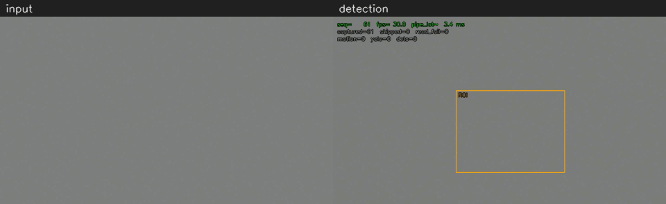
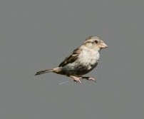

# CatchThatBird

[](https://github.com/SamJ12138/CatchThatBird/actions/workflows/ci.yml)



*Rendered from a pipeline run, not screen-recorded: the quickstart's synthetic clip (a noisy grey background with a public-domain house sparrow photo composited in) on the left, the preview's overlays on the right. The perch plays at 2x.*

CatchThatBird keeps a passive log of birds visiting a parked car, seen through a webcam (a DJI Osmo Pocket 3 in webcam mode, in the author's setup). It writes one line per visit to `data/events.jsonl`, plus a snapshot of each bird, so visit times can be analysed later. It sends no alerts and records no video. Detection is two-stage so that a laptop CPU is enough. Cheap background subtraction (MOG2) watches a region around the car on every frame, and the YOLOv8n neural network runs only on a small crop around motion, about once a second.

## Quickstart

This runs the whole pipeline on a generated video, with no camera. You need Python 3.12 or newer and git. Commands are the same in PowerShell and bash, except where two versions are shown.

**1. Clone**

```
git clone https://github.com/SamJ12138/CatchThatBird.git
cd CatchThatBird
```

**2. Create and activate a virtual environment**

PowerShell (Windows):

```
python -m venv .venv
.\.venv\Scripts\Activate.ps1
```

bash (Linux, macOS):

```
python3 -m venv .venv
source .venv/bin/activate
```

The prompt now starts with `(.venv)`. From here on, `python` means the environment's Python in both shells.
- **PowerShell refuses to run `Activate.ps1`** ("running scripts is disabled on this system", the default on a new Windows install): run `Set-ExecutionPolicy -Scope Process -ExecutionPolicy Bypass`, then `.\.venv\Scripts\Activate.ps1` again. The policy change lasts only for the current window.
- **Git Bash on Windows:** the activate command is `source .venv/Scripts/activate`.

**3. Install the dependencies**

```
python -m pip install -r requirements.txt
```

This installs the CPU build of PyTorch with Ultralytics, OpenCV and the smaller packages. `requirements.txt` explains how to use an NVIDIA GPU instead. Minimal Linux images may also need OpenCV's system libraries: `sudo apt-get install libgl1 libglib2.0-0`.

What you will see: pip downloads and installs about 50 packages and ends with `Successfully installed ...`. pip may also suggest upgrading itself; that is optional. On two test runs from a fresh clone (Windows, Python 3.14, empty pip cache) this step took 75 s and 86 s, and the PyTorch wheel was `torch-2.12.0+cpu`, 125 MB.

**4. Generate a test video**

```
python scripts/make_synth_video.py
```

What you will see: after a few seconds, one line (paths shortened here):

```
Wrote ...\data\samples\synth_bird.mp4 (600 frames, 1280x720@30); a house sparrow photo lands, perches and leaves inside ROI x=473 y=284 w=417 h=314 (scaled from roi.example.json)
```

The clip is synthetic: 20 s of a plain grey background with sensor-like noise. A real photo of a house sparrow is composited into it (public domain, U.S. Fish and Wildlife Service; source and license in [data/samples/assets/CREDITS.md](data/samples/assets/CREDITS.md)). The bird flies into the region of interest after 3 s, perches for about 13 s and flies off. `--no-bird` makes the older clip instead, a dark blob that YOLO never calls a bird.

**5. Run the pipeline on it**

```
python main.py --source data/samples/synth_bird.mp4 --headless --no-pace --yes
```

`--source` reads a file instead of the camera. `--headless` opens no windows. `--no-pace` processes every frame as fast as possible instead of at the video's 30 fps. `--yes` skips the camera checklist.

What you will see: a few seconds of log lines, then the prompt. The exit code is 0. Abridged:

```
INFO    | Run 85c3990f: structured log -> ...\logs\run_85c3990f.jsonl
WARNING | YOLO device=cpu -- torch was not built with CUDA. It will still work; ...
INFO    | Loading YOLO model 'yolov8n.pt' (auto-downloads on first run)
Downloading https://github.com/ultralytics/assets/releases/download/v8.4.0/yolov8n.pt to 'yolov8n.pt': 100% 6.2MB
INFO    | Opened video file data/samples/synth_bird.mp4: 1280x720 @ 30.0fps, 600 frames
WARNING | No roi.json yet: using the example ROI in roi.example.json, which was drawn for another camera. ...
WARNING | Saved ROI was for 1920x1080, current frame is 1280x720 (same aspect ratio): rescaled to x=473 y=284 w=417 h=314
INFO    | MOG2 warmup complete (60 frames). Detection pipeline active.
INFO    | BIRD detected (conf=0.92, bbox=583,457,103,67)
INFO    | BIRD detected (conf=0.91, bbox=583,457,103,68)
...       (14 "BIRD detected" lines, one per second while the bird perches)
INFO    | End of video file after 600 frames
INFO    | FrameGrabber stopped (captured=600, failures=0)
INFO    | Bird visit logged: 2026-09-30T15:54:31.165-04:00 seq=121 frames=14 conf=0.9216
```

`data/events.jsonl` now holds one visit. This is the line from that run: the real YOLOv8n on CPU, the synthetic clip with the real photo:

```
{"ts": "2026-09-30T15:54:31.165-04:00", "run_id": "85c3990f", "frame_seq": 121, "class": "bird", "confidence": 0.9216, "bbox_xywh": [583, 457, 103, 67], "snapshot_crop": "snapshots/20260930T155431.165_seq000121_d0_crop.jpg", "snapshot_full": "snapshots/20260930T155431.165_seq000121_d0_full.jpg", "last_seen": "2026-09-30T15:54:44.165-04:00", "visit_frames": 14, "truncated": false, "recovered": false}
```

The crop snapshot it points to (`data/snapshots/..._crop.jpg`) is the padded motion crop that YOLO classified when the visit opened:



*The quickstart's crop snapshot. The bird is a real photograph; the grey background around it is synthetic.*

- **First-run output.** The first run downloads the YOLOv8n weights (6.2 MB) to `yolov8n.pt` in the repository root. Ultralytics may also print a one-time notice about its settings file.
- **Expected warnings.** The CPU warning is expected with the CPU build. The two ROI warnings come from the example region of interest, which was drawn on a 1920x1080 camera and is rescaled here.
- **Numbers vary.** Your run id, timestamps and confidences will differ.
- **One visit covers the whole perch.** The bird lands just before 4 s into the clip and leaves at about 17 s. It was confirmed on 14 gated frames (`visit_frames`), and `last_seen` is 13 s after `ts`. The bird sits still, so the motion detector stops seeing it after landing. The visit stays open because YOLO re-checks the visit's last box once a second (see How it works).
- **Timestamps follow the clip.** For a video file, `ts` and `last_seen` are the time the run started reading plus the position in the clip. `--no-pace` therefore keeps the clip's timing, although the run takes only a few seconds.

**6. Read the run log**

```
python scripts/failure_report.py --latest
```

What you will see: a summary of the run you just made (abridged):

```
Runs: 1  Lines: 174  Unparseable lines: 0
  85c3990f: 2026-09-30T19:54:24.797+00:00 .. 2026-09-30T19:54:29.611+00:00  run success, exit_code=0, 4.8s

== Errors: stage x error_type (fail/skip lines carrying an error_type) ==
stage     input_invalid  external_api  parse  timeout  hardware  unknown  total
roi_load              1             .      .        .         .        .      1

== Skips: stage x reason ==
gate_check               cadence    522
gate_check                warmup     60
morph_contour        no_contours     17
detection_map         yolo_empty      2
persist                   dedupe     13
render                  headless    600

== Stages: totals and duration_ms ==
stage             success  fail  skip   p50_ms   p95_ms
detector_init           1     0     0  2342.12  2342.12
morph_contour           1     0    17     0.26     0.32
yolo_infer             16     0     0    36.98    61.95
persist                 1     0    13    11.47    11.47
mog2_apply *          600     0     0    ~1.19    ~1.89
```

How to read it:
- The one `roi_load` / `input_invalid` line is the example ROI's resolution not matching the clip. The ROI was rescaled, as the warning said.
- After the 60-frame warm-up, the motion gate ran on 18 frames (522 frames were skipped for cadence).
- Only the landing frame had motion. On the other 17 there was none (`no_contours`).
- YOLO still ran 16 times:
  - once on the motion crop at the landing;
  - once a second on the open visit's last box, confirming the bird 13 more times (`persist` / `dedupe`: merged into the visit);
  - twice more after the bird had flown off (`yolo_empty`).
- `persist` is the visit being written when the run ended.
- `docs/architecture.md` explains these costs.

**7. Your own camera**

To watch a real scene, go to [Running with a real camera](#running-with-a-real-camera) below. Stop that run with `q`, Esc or Ctrl-C, then read `data/events.jsonl` and `python scripts/failure_report.py --latest` as above.


## Running with a real camera

The pipeline was built for a DJI Osmo Pocket 3 connected over USB-C in webcam (UVC) mode, pointed at the car.

1. **Find the camera's device index.** Windows lists devices by name. On other systems the entries are `<device N>`, and you identify the camera by elimination.

   ```
   python main.py --list-devices
   ```

2. **Start with that device.** Or set `camera.device_index` in `config.yaml` instead of passing `--device`.

   ```
   python main.py --device 1
   ```

   Before the camera opens, a checklist is printed and the program waits for Enter:
   - gimbal mode set to Lock
   - ActiveTrack off
   - manual focus, on the car
   - 4x digital zoom (about 80 mm equivalent)
   - USB-C connected in Webcam mode
   - no other application using the camera
   - the selected index is the Pocket 3

   `--yes` skips the checklist for unattended runs.

3. **Draw the region to watch.** On the first run, a window opens on the first frame: drag a rectangle around the car, then press Enter or Space. `C` means "use the whole frame". The rectangle is saved to `data/roi.json` (not tracked by git) and reused. If only the resolution changed, it is rescaled. To redraw it:

   ```
   python main.py --select-roi
   ```

   A headless run with no `data/roi.json` uses `data/roi.example.json` and prints a warning. That example was drawn for the author's camera.

4. **Watch the preview.** It shows the ROI, detections and a three-line status display. `q` or `Esc` quits, and `s` saves the current frame to `data/snapshots/manual_*.jpg`. Ctrl-C, SIGTERM (Linux/macOS) and Ctrl-Break (Windows) also stop the run cleanly, and any visit still in progress is written first.

Other UVC webcams are untested but should work. Pass their index with `--device`, and ignore the Pocket-specific checklist items.

If the camera stops delivering frames for 2 s, the capture is closed and reopened, waiting 1, 2, 4, 8, 16 and then 30 s between attempts.

## How it works

The design, the threading model and the measured costs are in [docs/architecture.md](docs/architecture.md). Every stage and its failure modes are listed in [docs/pipeline-stages.md](docs/pipeline-stages.md). One frame's path:

```
 camera (UVC, MJPG) or --source file
        |
        v
 grabber thread: cap.read() -> Frame(image, seq, capture time) -> latest-frame slot
        |
        v  main thread takes the newest frame
 MOG2 background subtraction on the ROI ................ every frame
        |
        |  warm-up done, and the first or every Nth frame after it?  no -> next frame
        v  yes (about once a second)
 morphology, largest contour >= motion_min_area?                    no -> next frame
        |  yes
        v
 padded crop around the motion -> YOLOv8n, target classes only
   + for each open visit: padded crop around its last box -> YOLOv8n
     (every gated frame, motion or not, so a bird that sits still stays confirmed)
        |
        v
 EventLogger: same bird as an open visit (IoU >= 0.3, or centre within 2x its size; within 10 s)?
        |       yes -> extend the visit      no -> open a visit, save snapshots
        v
 data/events.jsonl: one line per visit, written when the visit closes
```

## Configuration

All settings are in `config.yaml`. Unknown keys and wrong types stop the program at startup with a one-line message. Use `--config PATH` for another file. Relative paths resolve against `--data-root` (default: the repository root), not the current directory.

| Key | Default | Meaning |
|---|---|---|
| `camera.device_index` | `0` | OpenCV index of the capture device (see `--list-devices`; `--device` overrides it) |
| `camera.width` | `1920` | Requested capture width. The driver may negotiate another size, which the log records |
| `camera.height` | `1080` | Requested capture height |
| `camera.fps` | `30` | Requested frame rate |
| `detection.process_every_n_frames` | `30` | After warm-up, run the motion gate on the first frame and then every Nth (about 1 Hz at 30 fps) |
| `detection.motion_min_area` | `200` | Smallest motion contour, in pixels, that is sent to YOLO |
| `detection.motion_threshold` | `16` | MOG2 `varThreshold`: how different a pixel must be from the background to count as motion |
| `detection.motion_padding_px` | `50` | Context added around the motion box before the YOLO crop |
| `detection.motion_warmup_frames` | `60` | Frames MOG2 learns from before any detection (about 2 s) |
| `detection.yolo_model` | `yolov8n.pt` | Ultralytics weights; downloaded on first use if missing |
| `detection.yolo_target_classes` | `[bird]` | COCO class names to keep |
| `detection.yolo_confidence_threshold` | `0.35` | Minimum YOLO confidence |
| `detection.dedupe_within_seconds` | `10` | A visit closes after this long without the bird being confirmed |
| `detection.visit_iou_threshold` | `0.3` | A detection joins an open visit if its box overlaps the visit's last box by at least this IoU ... |
| `detection.visit_center_distance` | `2.0` | ... or if its centre is within this many times max(width, height) of the last box's centre |
| `detection.max_visit_seconds` | `600` | A visit this long is written with `"truncated": true`, and the next confirmation opens a new one |
| `logging.events_file` | `data/events.jsonl` | Where visits are appended |
| `logging.snapshots_dir` | `data/snapshots` | Where snapshots are written |
| `logging.snapshot_format` | `jpeg` | `jpeg` or `png` |
| `logging.snapshot_quality` | `90` | JPEG quality |
| `logging.save_full_frame` | `true` | Save the full frame as well as the crop for each visit |
| `storage.max_events_per_day` | `500` | New visits beyond this many per day are dropped (disk-fill guard) |
| `storage.retention_days` | `30` | Snapshots older than this are deleted at startup; `events.jsonl` is never truncated |

Command-line flags (`python main.py --help`):

| Flag | Meaning |
|---|---|
| `--list-devices` | List capture devices and exit |
| `--device N` | Use capture device N |
| `--select-roi` | Redraw the region of interest |
| `--source PATH` | Read a video file instead of the camera (no device listing, no checklist; exit 0 at end of file) |
| `--headless` | No windows: no preview, no ROI dialog |
| `--no-pace` | With `--source`: process every frame as fast as possible instead of at the file's frame rate |
| `--yes` | Skip the camera checklist |
| `--config PATH` | Config file (default `config.yaml`) |
| `--data-root DIR` | Base for relative `logging.*` paths (default: repository root) |
| `--roi-file PATH` | ROI file (default `data/roi.json`) |
| `--log-dir DIR` | Where the run log goes (default `logs/`) |
| `--first-frame-timeout SECONDS` | Exit 1 if no frame arrives in time (default 5) |
| `--annotate-out PATH` | With `--source`: also write every processed frame, with the preview's overlays, to a video file (`.mp4`, or `.avi` for MJPG). Works with `--headless`. Not available for the camera, which is never recorded |

Exit codes: 0 for a normal end, including Ctrl-C and SIGTERM; 1 for an error, with a one-line message; 2 if stdin closed at the checklist (use `--yes`).

## Output

**`data/events.jsonl`** has one JSON object per visit. A bird that stays in place is one line, however many frames it appears in. The full definition is in [docs/events-schema.md](docs/events-schema.md).

| Field | Meaning |
|---|---|
| `ts` | Capture time of the visit's first detection, local ISO 8601 with milliseconds and offset |
| `run_id` | The run that saw it; names `logs/run_<run_id>.jsonl` |
| `frame_seq` | Frame number of that first detection within the run |
| `class` | Detected class (`bird`) |
| `confidence` | YOLO confidence of the first detection |
| `bbox_xywh` | Box in full-frame pixels: x, y, width, height |
| `snapshot_crop` | The crop YOLO saw, relative to the snapshots directory's parent (`snapshots/<name>.jpg`), or `null` |
| `snapshot_full` | The full frame, same convention, or `null` |
| `last_seen` | Capture time of the last matching detection |
| `visit_frames` | Gated frames in which the bird was detected |
| `truncated` | `true` if the visit was cut at `detection.max_visit_seconds`; the bird's next confirmation starts a new line |
| `recovered` | `true` if the line was written at startup from `data/open_visits.json`: the visit was still open when the previous run was killed |

Lines are written when a visit closes: 10 s after the bird was last seen, or when the run ends. The run ends on a normal exit, an error, Ctrl-C, SIGTERM or Ctrl-Break. Open visits are also saved to `data/open_visits.json`: whenever a visit opens or closes, and every 60 s. After a hard kill (SIGKILL, `taskkill /F`, power loss), the next start writes them with `"recovered": true`. Only the last 60 s of an open visit (at most) are lost.

**Visits per hour.** `scripts/plot_visits.py` counts visits by hour of day (the local clock in each `ts`, all days summed) and writes a bar chart. It needs matplotlib, which `requirements-dev.txt` lists and Ultralytics already installs:

```
python scripts/plot_visits.py                      # data/events.jsonl -> docs/visits.png
python scripts/plot_visits.py path/to/events.jsonl --out visits.png --title "Week 1"
```

**Snapshots** are named `<local time>_seq<frame, 6 digits>_d<index>_{crop,full}.jpg`, for example `20260930T140506.789_seq000091_d0_crop.jpg`.

**Run logs.** Every run writes `logs/run_<run_id>.jsonl`, one line per stage event (`start`, `success`, `fail`, `skip`, with an `error_type`). Per-frame stages are summarised every 300 frames. To see what failed or was skipped and how long each stage took:

```
python scripts/failure_report.py --latest     # newest run
python scripts/failure_report.py              # every run in logs/
python scripts/failure_report.py logs/run_<run_id>.jsonl
```

## Development

```
python -m pip install -r requirements-dev.txt
python -m pytest -m "not slow"          # the fast suite: no camera, no YOLO
python -m pytest                        # adds the one test that loads the real yolov8n.pt
python -m pytest -m "not slow" --cov    # with coverage, as CI runs it
python scripts/make_demo_gif.py         # regenerate docs/demo.gif
```

`make_demo_gif.py` runs `main.py --annotate-out` on `data/samples/demo.mp4` if that file exists, else on `synth_bird.mp4`, in a temporary directory (your `data/events.jsonl` is not touched). It cuts from 2 s before the first visit's `ts` to 2 s after its `last_seen`, and puts the input and the annotated frames side by side. If that is longer than 12 s, the perch plays faster, with a label such as `2x`. ffmpeg comes from `imageio-ffmpeg` in `requirements-dev.txt`.

CI (`.github/workflows/ci.yml`, badge at the top) runs the fast suite with coverage on Ubuntu and Windows, Python 3.12, on every push and pull request.

The `slow` marker covers two tests that run the real model in a subprocess: a smoke test on the blob clip, and a check that the synthetic bird is detected where the script drew it. Everything else uses test doubles from `tests/fakes.py`:

- **`FakePredictor`** stands in for YOLO. The detector reaches YOLO only through a small `Predictor` protocol (`load()`, `predict()`, `names`), so a test passes the fake in:

  ```python
  fake = FakePredictor({91: [(300, 150, 30, 20)]})    # frame_seq -> boxes in full-frame pixels
  main.main(["--source", "clip.mp4", "--headless", "--no-pace"], predictor=fake)
  # or: Detector(config.detection, obs=obs, predictor=fake)
  ```

  On a gated frame whose number is in the dict, it returns those boxes, converted to crop coordinates the way YOLO would report them. On every other frame it returns nothing. `fake.calls` records every call. The test process never imports ultralytics, and a session check enforces this.
- **`FakeCapture` / `FakeDevice`** replace `cv2.VideoCapture`. They cover endless or finite frames, failed reads and opens, a read that raises, and a read that never returns.
- **`FakeClock`** is injected as `clock=` / `sleep=` into `FrameGrabber` and `main.main`. Pacing, the stall timer and the reconnect backoff then run in fake time.
- **`tests/main_with_fakes.py`** runs `main.main()` in a subprocess with the fakes installed from the `CTB_FAKES` environment variable. It is used for exit codes and signal handling.

The suite fails any test that takes more than 5 s, or that calls `time.sleep()` for more than 100 ms.

## Status and roadmap

| Phase | Scope | State |
|---|---|---|
| 1 | Camera: device discovery, threaded capture, preview | done |
| 2 | Detection: MOG2 motion gate, YOLOv8n on the motion crop, ROI | done |
| 3 | Event log: `events.jsonl`, snapshots, dedupe, daily cap, retention | done |
| 4 | Streamlit dashboard to review visits and snapshots | open |
| 5 | Reliability: camera reconnect with backoff, exit codes, structured run logs, clean shutdown | done |
| 6 | Visit-pattern analysis (times of day, durations) | open |

Known limitations:

- **Capture backends are Windows-first.** Device names come from DirectShow, and capture tries DirectShow, then Media Foundation. Video files work on any OS, but live capture on Linux and macOS is untested.
- **Only the single largest motion contour** in the ROI goes to YOLO on each gated frame. Two birds far apart can yield one detection.
- **CPU-only by default.** A CUDA build of PyTorch speeds up only the YOLO step (see `requirements.txt`).
- **A hard kill loses at most the last 60 s of an open visit.** The visit itself is recovered on the next start from `data/open_visits.json`, with `"recovered": true`, but `last_seen` and `visit_frames` are as of the last checkpoint.
- **Two birds close together can merge.** A detection joins an open visit if its centre is within 2x the visit's box size. That keeps a hopping bird in one visit, but two birds perched side by side count as one.
- **Open visits cost YOLO time.** While a visit is open, each gated frame runs YOLO once per open visit, plus once for motion elsewhere. That continues for up to `dedupe_within_seconds` after the bird has left.
- **Anything YOLO keeps calling a bird stays one long visit.** A still object that YOLO scores at or above the threshold (a decoy, say) is written as a truncated visit every `max_visit_seconds` (10 min by default), for as long as it stays.

## License

MIT. See [LICENSE](LICENSE).
